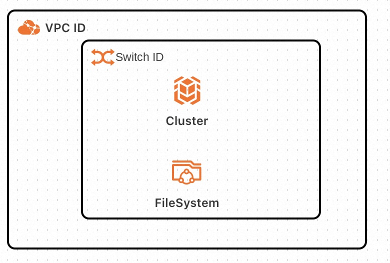
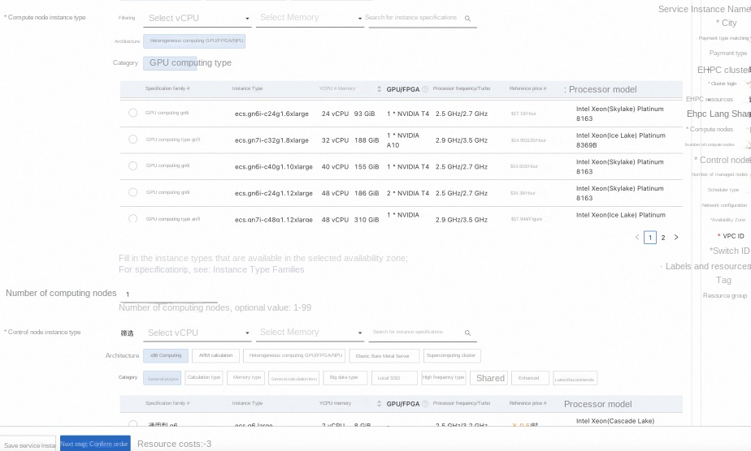
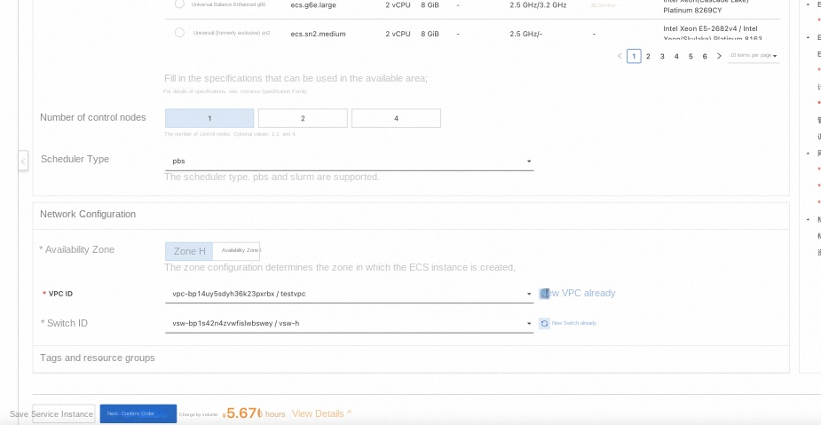
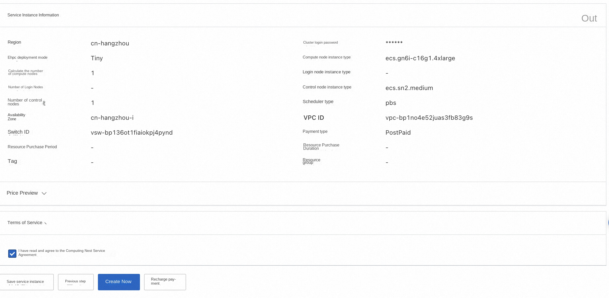
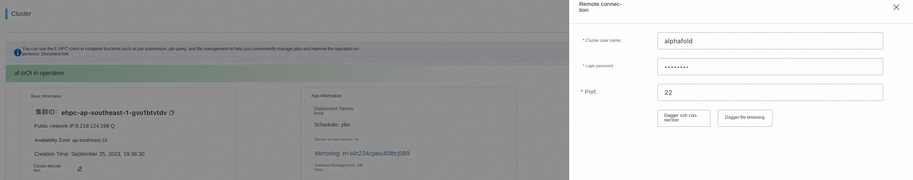
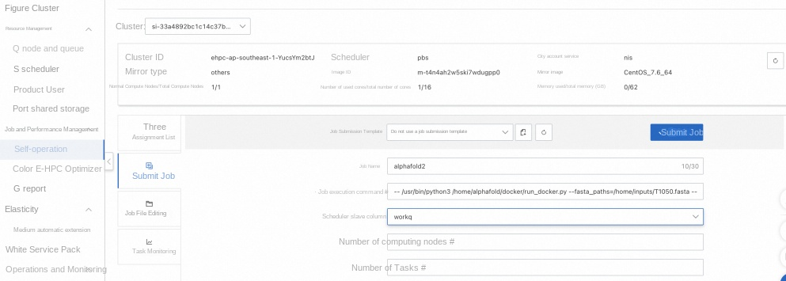
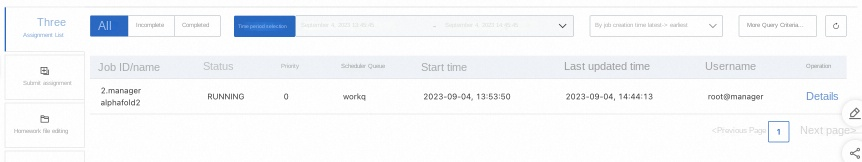
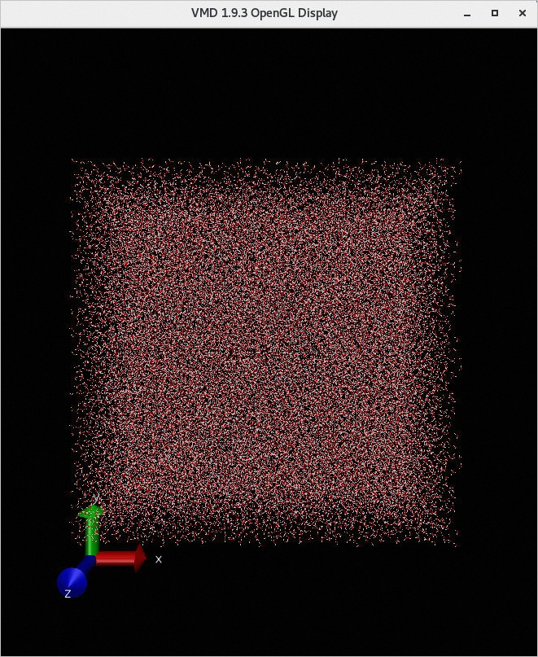
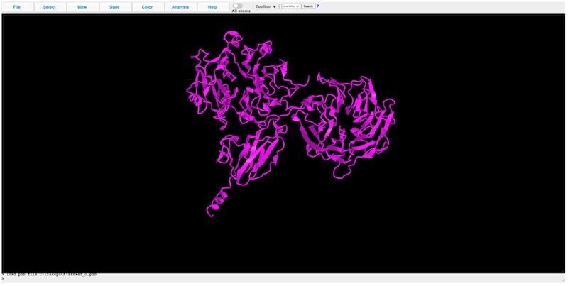

# AlphaFold2 Ehpc computing nest for rapid deployment

> **Disclaimer:** This service is provided by a third party. We try our best to ensure its safety, accuracy and reliability, but we cannot guarantee that it is completely free from failures, interruptions, errors or attacks. Therefore, the company hereby declares that it makes no representations, warranties or commitments regarding the content, accuracy, completeness, reliability, suitability and timeliness of the Service and is not liable for any direct or indirect loss or damage arising from your use of the Service; for third-party websites, applications, products and services that you access through the Service, do not assume any responsibility for its content, accuracy, completeness, reliability, applicability and timeliness, and you shall bear the risks and responsibilities of the consequences of use; for any loss or damage arising from your use of this service, including but not limited to direct loss, indirect loss, loss of profits, loss of goodwill, loss of data or other economic losses, even if we have been advised in advance of the possibility of such loss or damage; we reserve the right to amend this statement from time to time, so please check this statement regularly before using the Service. If you have any questions or concerns about this Statement or the Service, please contact us.

## Overview

AlphaFold2 is a DeepMind-made deep learning model for protein structure prediction. This article introduces the rapid deployment AlphaFold2 of Alibaba Cloud ehpc Nvidia GPU specifications and computing nest.

## Prerequisites

To deploy the AlphaFold2 Community Edition service instance, you need to access and create some Alibaba Cloud resources. Therefore, your account must contain permissions for the following resources.
**Note**: This permission is required only when your account is a RAM account.

| Permission policy name | Comment |
| ------------------------------------- | -------------------- |
| AliyunECSFullAccess | Permissions to manage ECS instances |
| AliyunEHPCFullAccess | Manage permissions for Elastic High Performance Computing (EHPC) |
| AliyunNASFullAccess | Manage NAS permissions |
| AliyunVPCFullAccess | Permissions to manage a VPC |
| AliyunROSFullAccess | Manage permissions for Resource Orchestration Service (ROS) |
| AliyunComputeNestUserFullAccess | Manage user-side permissions for the compute nest service (ComputeNest) |

## Billing Description

The cost of AlphaFold2 Community Edition deployment in Computing Nest mainly involves:

-Elastic High Performance Computing Cluster (EHPC) fees
-File system (NAS) fees
-Traffic bandwidth charges

## Deployment Architecture

-deployment consists of an ehpc cluster, which includes one manager node and multiple compute nodes
-manager and compute nodes are deployed on ecs instances, compute of which contains a gpu card.
-The service uses nas-cpfs to build a high-performance shared file system

## Parameter description
| Parameter group | Parameter item | Description |
| ------------- | ---------- | -------------------------------------------------------- |
| Service Instance | Service Instance Name | The service instance name must be no more than 64 characters in length and must start with an English letter. It can contain numbers, English letters, dashes (-), and underscores (_). |
| | Region | The region where the service instance is deployed |
| | Billing Type | Billing type of the resource: Pay by Two and Subscription |
| EHPC Cluster Configuration | Cluster Login Password | 8-30 in length and must contain three items (uppercase letters, lowercase letters, numbers, ()'~!@#$%^& *-+ =|{}[]:;' <>,.?/special symbols) |
| | Ehpc Deployment Modes | Tiny,Simple,Standard |
| | Computing node instance type | Computing node specifications available in the zone |
| | Number of compute nodes | Number of compute nodes, optional value: 1-99 |
| | Logon node instance type | Logon node specifications available in the zone |
| | Number of control nodes | Number of control nodes, optional values: 1,2,4 |
| EHPC Login Configuration | Login Username | |
| | Login user password | 8-30 in length and must contain three items (uppercase letters, lowercase letters, numbers, ()'~!@#$%^& *-+ =|{}[]:;' <>,.?/special symbols) |
| Network Configuration | Availability Zone | The zone where the ECS instance is located |
| | VPC ID | The VPC where the resource resides |
| | VSwitch ID | VSwitch where the resource resides |

## Deployment process
1. Visit the Computing Nest AlphaFold2 Community Edition [Deployment Link](https://computenest.console.aliyun.com/user/cn-hangzhou/serviceInstanceCreate?ServiceId=service-3b7139109894484eb0a4)
, fill in the deployment parameters as prompted:

2. After completing the parameters, you can see the corresponding RFQ details. After confirming the parameters, click **Next: Confirm Order**.

3. Confirm the order and agree to the service agreement and click **Create Now**
Enter the deployment phase. The deployment will take several hours, and the download data will be slow. The log of the download output is stored in/root/download.log

4. Wait for the data to be downloaded before you can start using the service. Can go to [CASP14](https://www.predictioncenter.org/casp14/targetlist.cgi)
[Sample data](https://www.predictioncenter.org/casp14/target.cgi?target=T1050&view=sequence) for copy T1050 in
Store it in/home/alphafold/T1050.fasta, log in through ehpc [console login cluster](https://help.aliyun.com/zh/e-hpc/user-guide/log-on-to-a-cluster?spm=a2c4g.11186623.0.0.3 dff56fdLxmQbl#section-wl8-aio-0wu), and enter the user name and password.

5. Then go to ehpc console task management to execute commands.

bash
-- /usr/bin/python3 /home/share/alphafold/docker/run_docker.py --fasta_paths=/home/alphafold/T1050.fasta --max_template_date=2020-05-14 --data_dir=/home/data --docker_image_name=alphafold:latest --output_dir=/home/alphafold
'''

7. Check the ehpc task status and wait for a few hours to find it.
The/home/alphafold/directory generates the corresponding log (T1050.e1) and result (T1050 folder). Enter T1050 folder and copy rank_0.pdb.

8. Results in protein structure prediction [website](https://www.ncbi.nlm.nih.gov/Structure/icn3d/full.html)
Open rank_0.pdb in and you will see the corresponding protein structure.

