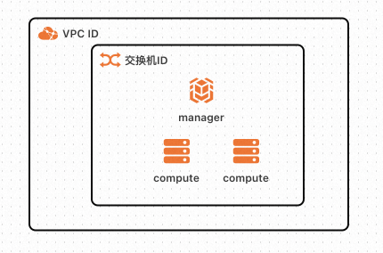
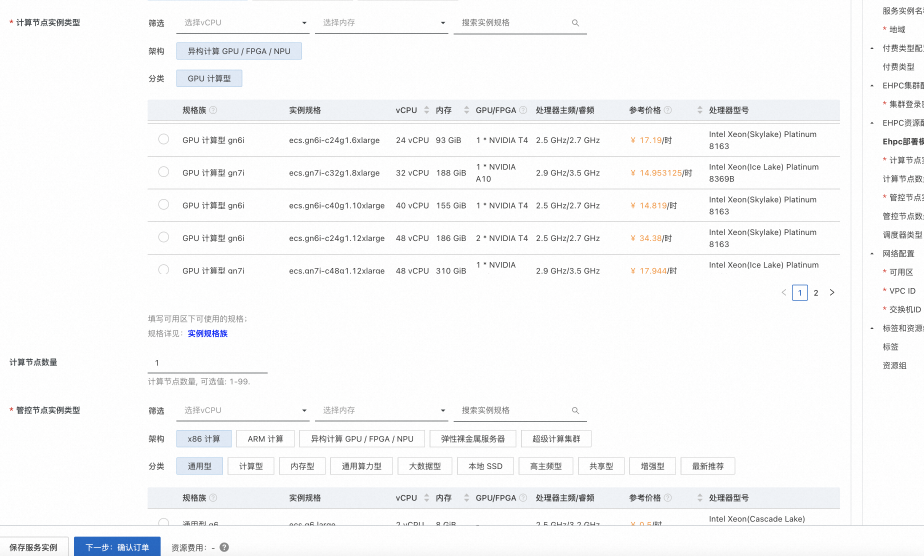
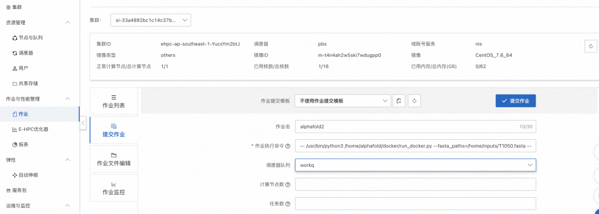
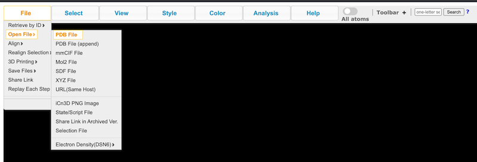

# AlphaFold2 Ehpc计算巢快速部署


>**免责声明：**本服务由第三方提供，我们尽力确保其安全性、准确性和可靠性，但无法保证其完全免于故障、中断、错误或攻击。因此，本公司在此声明：对于本服务的内容、准确性、完整性、可靠性、适用性以及及时性不作任何陈述、保证或承诺，不对您使用本服务所产生的任何直接或间接的损失或损害承担任何责任；对于您通过本服务访问的第三方网站、应用程序、产品和服务，不对其内容、准确性、完整性、可靠性、适用性以及及时性承担任何责任，您应自行承担使用后果产生的风险和责任；对于因您使用本服务而产生的任何损失、损害，包括但不限于直接损失、间接损失、利润损失、商誉损失、数据损失或其他经济损失，不承担任何责任，即使本公司事先已被告知可能存在此类损失或损害的可能性；我们保留不时修改本声明的权利，因此请您在使用本服务前定期检查本声明。如果您对本声明或本服务存在任何问题或疑问，请联系我们。

## 概述

AlphaFold2是DeepMind制造的深度学习模型，用于蛋白质结构预测。本文介绍了通过阿里云ehpc Nvidia GPU规格和计算巢快速部署AlphaFold2。

## 前提条件

部署AlphaFold2社区版服务实例，需要对部分阿里云资源进行访问和创建操作。因此您的账号需要包含如下资源的权限。
  **说明**：当您的账号是RAM账号时，才需要添加此权限。

  | 权限策略名称                          | 备注                     |
  |---------------------------------|------------------------|
  | AliyunECSFullAccess             | 管理云服务器服务（ECS）的权限       |
  | AliyunEHPCFullAccess            | 管理弹性高性能计算（EHPC）的权限     |
  | AliyunNASFullAccess             | 管理文件存储（NAS）的权限         |
  | AliyunVPCFullAccess             | 管理专有网络（VPC）的权限         |
  | AliyunROSFullAccess             | 管理资源编排服务（ROS）的权限       |
  | AliyunComputeNestUserFullAccess | 管理计算巢服务（ComputeNest）的用户侧权限 |


## 计费说明

AlphaFold2社区版在计算巢部署的费用主要涉及：

- 弹性高性能计算集群（EHPC）费用
- 文件系统（NAS）费用
- 流量带宽费用

## 部署架构


- 部署由一个ehpc集群组成，ehpc集群中包括1台manager节点和多台compute节点
- manager和compute节点都部署在ecs上，其中compute节点包含gpu卡
- 服务使用nas-cpfs构建高性能共享文件系统

## 参数说明
| 参数组         | 参数项      | 说明                                                                     |
|-------------|----------|------------------------------------------------------------------------|
| 服务实例        | 服务实例名称   | 长度不超过64个字符，必须以英文字母开头，可包含数字、英文字母、短划线（-）和下划线（_）                          |
|             | 地域       | 服务实例部署的地域                                                              |
|             | 付费类型     | 资源的计费类型：按两付费和包年包月                                                      |
| EHPC集群配置    | 集群登录密码   | 长度8-30，必须包含三项（大写字母、小写字母、数字、 ()`~!@#$%^&*-+=&#124;{}[]:;'<>,.?/ 中的特殊符号） | Ehpc部署模式 | Tiny，Simple，Standard                          |
|             | 计算节点实例类型 | 可用区下可以使用的计算节点规格                                                        |
|             | 计算节点数量   | 计算节点数量, 可选值: 1-99                                                      |
|             | 登录节点实例类型 | 可用区下可以使用的登录节点规格                                                        |
|             | 管控节点数量   | 管控节点数量, 可选值: 1,2,4                                                     |
| 网络配置        | 可用区      | ECS实例所在可用区                                                             |
|             | VPC ID   | 资源所在VPC                                                                |
|             | 交换机ID    | 资源所在交换机                                                                |

## 部署流程
1. 访问计算巢AlphaFold2社区版[部署链接](https://computenest.console.aliyun.com/user/cn-hangzhou/serviceInstanceCreate?ServiceId=service-3b7139109894484eb0a4)
，按提示填写部署参数：
    

2. 参数填写完成后可以看到对应询价明细，确认参数后点击**下一步：确认订单**。
   

3. 确认订单完成后同意服务协议并点击**立即创建**
   进入部署阶段。部署会用时几个小时，下载数据会比较慢，下载输入的日志存放在/root/download.log中
    

4. 等待下载数据完毕后就可以开始使用服务。可以到[CASP14](https://www.predictioncenter.org/casp14/targetlist.cgi)
   中拷贝T1050的[示例数据](https://www.predictioncenter.org/casp14/target.cgi?target=T1050&view=sequence)
   存放到/home/inputs/T1050.fasta中，然后 ssh 到ehpc manager节点执行命令让 qmgr 允许 root 执行:
    
    ```
    /usr/local/pbs/bin/qmgr -c "set server acl_roots = root"
    ```

5. 然后到ehpc控制台任务管理执行命令。

    ```
    -- /usr/bin/python3 /home/alphafold/docker/run_docker.py --fasta_paths=/home/inputs/T1050.fasta --max_template_date=2020-05-14--data_dir=/home/data --docker_image_name=alphafold:2.0 --output_dir=/home/outputs
    ```

6. 查看ehpc任务状态等待几个小时后发现
   /home/outputs目录生成了对应的结果，拷贝出rank_0.pdb。

7. 在蛋白质结构预测结果[网站](https://www.ncbi.nlm.nih.gov/Structure/icn3d/full.html)
   中打开rank_0.pdb，会看到对应的蛋白质结构。

